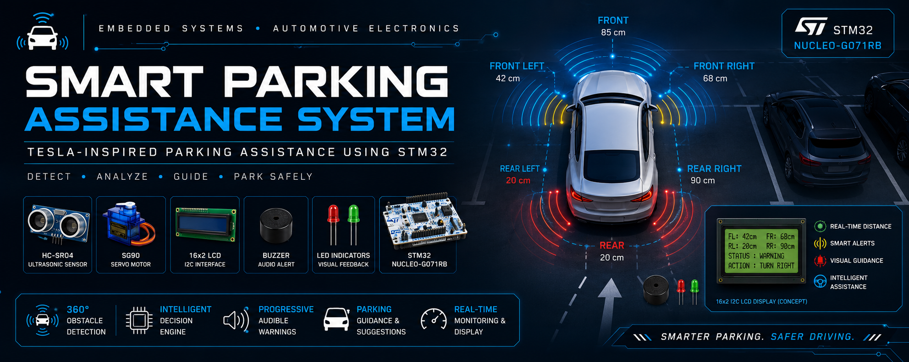

# Smart Parking Assistance System



[](LICENSE)
[](https://www.st.com/en/microcontrollers-microprocessors/stm32g071rb.html)
[](https://www.st.com/en/evaluation-tools/nucleo-g071rb.html)
[](https://www.st.com/en/development-tools/stm32cubeide.html)
[](#)
[](.github/workflows/build-check.yml)

An original, independent **embedded systems firmware project** implementing
a four-corner ultrasonic parking assistance system, inspired by the general
*behavior* of modern premium-vehicle parking assist features — built from
scratch on an STM32 NUCLEO-G071RB.

> **Attribution note:** This is an original educational implementation. It
> is **not** affiliated with, endorsed by, or derived from any vehicle
> manufacturer's source code, UI, trademarks, or documentation. It only
> implements similar general *concepts* (multi-sensor obstacle detection,
> progressive warnings, steering guidance) using original code.

---

## Table of Contents

- [Project Overview](#project-overview)
- [Problem Statement](#problem-statement)
- [Objectives](#objectives)
- [Features](#features)
- [Applications](#applications)
- [Working Principle](#working-principle)
- [Hardware Used](#hardware-used)
- [Software Used](#software-used)
- [Development Environment](#development-environment)
- [Peripheral Usage](#peripheral-usage)
- [Pin Configuration](#pin-configuration)
- [Hardware Connections](#hardware-connections)
- [Software Architecture](#software-architecture)
- [Finite State Machine](#finite-state-machine)
- [Folder Structure](#folder-structure)
- [Installation](#installation)
- [Flashing Instructions](#flashing-instructions)
- [Testing Procedure](#testing-procedure)
- [Expected Results](#expected-results)
- [Advantages](#advantages)
- [Limitations](#limitations)
- [Future Improvements](#future-improvements)
- [Skills Demonstrated](#skills-demonstrated)
- [Author](#author)
- [License](#license)
- [Acknowledgements](#acknowledgements)

---

## Project Overview

The Smart Parking Assistance System continuously monitors the space around
a vehicle using four ultrasonic sensors (front-left, front-right,
rear-left, rear-right), fuses those readings through a noise-filtering
pipeline, and drives a real-time decision engine that determines:

- **How urgent** the closest obstacle is (Safe → Caution → Warning →
  Critical → Emergency)
- **Which direction** the driver should steer to avoid it
- **Whether to stop entirely**

That information is presented on a 16x2 LCD, reinforced with progressive
buzzer alerts and red/green LED indicators, and streamed over UART for
debugging or logging.

## Problem Statement

Parking in tight spaces is one of the most collision-prone maneuvers for
drivers, particularly with limited rear/side visibility. Dedicated parking
assistance hardware in production vehicles is a black box to most
embedded engineers. This project builds an original, from-scratch
implementation of the *underlying concepts* — multi-sensor fusion,
progressive alerting, and simple steering guidance — as a demonstrable,
fully open embedded systems portfolio piece.

## Objectives

- Implement reliable, low-latency ultrasonic distance sensing on a
  resource-constrained Cortex-M0+ MCU.
- Build a robust noise-filtering pipeline suitable for noisy, low-cost
  ultrasonic sensors.
- Design a clean, modular, layered firmware architecture (application /
  sensor manager / drivers / board support) driven by an explicit finite
  state machine.
- Provide clear, real-time feedback to the driver via LCD, buzzer, and
  LEDs.
- Produce professional, ATS-friendly documentation suitable for a GitHub
  portfolio.

## Features

- 4-corner ultrasonic obstacle detection (HC-SR04)
- Median + exponential moving average noise filtering
- 5-level severity classification (Safe/Caution/Warning/Critical/Emergency)
- Progressive buzzer warning patterns (silent → slow → medium → fast → continuous)
- Steering guidance engine (Turn Left / Turn Right / Centered / Proceed Slowly / STOP)
- Servo-driven sensor sweep scanning (0°–180°, 5 steps)
- Live 16x2 I2C LCD status display
- Red/Green/Heartbeat LED status indication
- UART debug telemetry stream (115200 baud)
- Explicit finite state machine with self-test and fault recovery
- Fully modular firmware architecture with centralized pin/config headers

## Applications

- Embedded systems / automotive electronics portfolio demonstration
- Educational reference for ultrasonic sensor fusion on STM32
- Base platform for DIY parking-assist add-ons (RC cars, golf carts, small
  utility vehicles, robotics platforms)
- Teaching example for finite-state-machine-driven embedded firmware design

## Working Principle

1. Four HC-SR04 sensors are triggered each scan cycle; the SG90 servo
   sweeps through five positions to broaden situational awareness.
2. Each echo pulse is timestamped via EXTI interrupts against a
   free-running 1MHz timer, giving microsecond-resolution distance
   measurement without blocking the CPU.
3. Raw distances pass through a rolling median filter (rejects single-shot
   sensor glitches) followed by an exponential moving average (smooths the
   displayed value).
4. The decision engine classifies each corner's severity against
   configurable thresholds, determines the worst-case severity, and
   compares left vs. right sides to recommend a steering action.
5. The LCD, buzzer, and LEDs are updated to reflect the current
   severity/action, and a UART telemetry line is transmitted for
   debugging.

See [`docs/firmware-architecture.md`](docs/firmware-architecture.md) for
the full data-flow diagram.

## Hardware Used

| Component | Qty |
|---|---|
| STM32 NUCLEO-G071RB | 1 |
| HC-SR04 ultrasonic sensor | 4 |
| 16x2 LCD with I2C (PCF8574) backpack | 1 |
| SG90 servo motor | 1 |
| Piezo buzzer | 1 |
| Red LED | 1 |
| Green LED | 1 |
| Push button | 1 |
| USB cable / 5V supply | 1 |

Full BOM and wiring notes: [`hardware/README.md`](hardware/README.md).

## Software Used

- **STM32CubeIDE** — firmware development, build, flash, debug
- **STM32CubeMX** — peripheral clock/pin configuration (`.ioc` project)
- **STM32 HAL drivers** — GPIO, TIM, I2C, UART, EXTI, RCC
- **Embedded C (C99)**

## Development Environment

- Target platform: **STM32 NUCLEO-G071RB** (STM32G071RBT6, Arm Cortex-M0+, 64 MHz)
- Toolchain: GNU Arm Embedded Toolchain (bundled with STM32CubeIDE)
- Programming language: **Embedded C**, HAL-based (no direct register
  manipulation except where HAL doesn't expose a needed feature)

## Peripheral Usage

| Peripheral | Usage |
|---|---|
| GPIO | Trigger outputs, LEDs, buzzer, echo/button inputs |
| TIM2 | Free-running 1MHz microsecond timer (echo pulse timing) |
| TIM3 | PWM generation for servo control (50Hz) |
| UART (USART2) | Debug telemetry, 115200 baud |
| I2C1 | 16x2 LCD communication (PCF8574 backpack) |
| EXTI | Ultrasonic echo edge capture + parking-mode button |
| SysTick | 1ms system tick, drives the FSM scheduler |

## Pin Configuration

Full pin map: [`docs/pin-configuration.md`](docs/pin-configuration.md)
(mirrors [`firmware/Core/Inc/pin_map.h`](firmware/Core/Inc/pin_map.h), the
single source of truth for all pin assignments).

## Hardware Connections

Wiring overview and power budget notes:
[`hardware/README.md`](hardware/README.md).

## Software Architecture

Layered architecture (Application → Sensor Manager / Board Support →
Drivers → HAL). Full breakdown with diagram:
[`docs/firmware-architecture.md`](docs/firmware-architecture.md).

## Finite State Machine

`SYSTEM_INIT → SELF_TEST → SENSOR_SCAN → FILTER_DATA → PROCESS_DATA →
DECISION_ENGINE → DISPLAY_UPDATE → WARNING_CONTROL → UART_UPDATE → (loop)`,
with `IDLE` and `ERROR` as side states. Full diagram and transition table:
[`docs/state-machine.md`](docs/state-machine.md).

## Folder Structure

```
Smart-Parking-Assistance-System/
├── .github/              CI workflow + issue templates
├── docs/                  Architecture, FSM, pin config, testing docs
├── firmware/               Complete STM32CubeIDE project
│   ├── Core/Inc/            Headers
│   ├── Core/Src/            Sources
│   ├── Core/Startup/        Startup assembly / vector table
│   ├── Drivers/             STM32 HAL + CMSIS (generated, see its README)
│   └── cube_mx/              STM32CubeMX .ioc project
├── hardware/               BOM, wiring, power notes
├── images/                 Diagrams / screenshots (see its README)
├── simulations/            Host-side simulation notes for sensor-independent logic
├── datasheets/             Links to official component datasheets
├── README.md               This file
├── LICENSE                 MIT
├── CHANGELOG.md
├── CONTRIBUTING.md
├── CODE_OF_CONDUCT.md
└── CITATION.cff
```

## Installation

1. Clone this repository.
2. Populate `firmware/Drivers/` via STM32CubeMX (see
   [`firmware/Drivers/README.md`](firmware/Drivers/README.md)).
3. Open `firmware/` in STM32CubeIDE as an existing project.

Full instructions: [`firmware/README.md`](firmware/README.md).

## STM32CubeIDE Build Instructions

See [`firmware/README.md`](firmware/README.md#build-instructions).

## Flashing Instructions

See [`firmware/README.md`](firmware/README.md#flashing-instructions).

## Testing Procedure

A realistic, reproducible manual test procedure (no fabricated logs or
captures) is documented in [`docs/testing.md`](docs/testing.md).

## Expected Results

- LCD displays live front/rear distances and the recommended driver
  action, refreshed roughly 5 times per second.
- Buzzer cadence audibly increases in urgency as an obstacle gets closer,
  becoming continuous inside 10cm.
- Red/Green LEDs mirror overall severity.
- UART emits a structured telemetry line (`FL:.. FR:.. RL:.. RR:..
  STATE:.. SEVERITY:.. ACTION:..`) roughly 4 times per second.
- On a sensor/LCD wiring fault, the system enters `ERROR` with a fast-blink
  red LED and a fault code shown on the LCD rather than silently
  misbehaving.

Exact numeric results will vary by your specific sensors/wiring — see
[`docs/testing.md`](docs/testing.md) for how to validate on your own bench.

## Advantages

- Fully modular, easy to extend or port to a different sensor count/layout
- Non-blocking, interrupt-driven sensor timing (CPU stays free for other
  work between triggers)
- Explicit FSM makes system behavior easy to reason about and debug
- Centralized configuration (`config.h`, `pin_map.h`) makes retuning or
  re-wiring straightforward
- Graceful fault detection and recovery path built in from the start

## Limitations

- HC-SR04 sensors have a relatively narrow, cone-shaped beam and can miss
  small or angled obstacles, and their accuracy is temperature-dependent
  (no temperature compensation is implemented in v1.0.0).
- Ultrasonic cross-talk between adjacent sensors firing in quick
  succession is not actively mitigated beyond firmware timing spacing —
  acceptable for a portfolio/demo build, but a production system would add
  sensor-to-sensor scheduling or frequency diversity.
- No persistent configuration storage (thresholds live in Flash-compiled
  constants, not user-adjustable at runtime).
- Single-vehicle, single-scan-rate design; not a substitute for a
  certified automotive safety system.

## Future Improvements

See [`docs/future-improvements.md`](docs/future-improvements.md) for the
full roadmap (temperature compensation, graphical display, HIL testing,
BLE companion app, and more).

## Skills Demonstrated

- Embedded C firmware development (C99, HAL-based) on Arm Cortex-M0+
- Interrupt-driven sensor timing (EXTI + free-running timer pulse
  measurement)
- Digital signal filtering (median + exponential moving average)
- Finite state machine design for real-time embedded control
- I2C and UART peripheral driver development
- PWM-based actuator control (servo)
- Modular, layered firmware architecture
- Professional technical documentation and open-source project structure
- STM32CubeIDE / STM32CubeMX toolchain proficiency

## Author

Maintained by the Smart Parking Assistance System project contributors.
Feel free to open an issue or pull request — see
[`CONTRIBUTING.md`](CONTRIBUTING.md).

## License

Released under the [MIT License](LICENSE).

## Acknowledgements

- STMicroelectronics for the STM32 HAL and STM32CubeIDE/CubeMX tooling
- The broader open-source embedded systems community for HC-SR04 and
  HD44780/PCF8574 driver reference material that informed (but was not
  copied into) this original implementation
