# Smart Parking Assistance System

<p align="center">
  
</p>

<p align="center">


</p>

---

## Smart Parking Assistance System

An Embedded Systems project that implements an intelligent parking assistance system using the **STM32 NUCLEO-G071RB** microcontroller.

The system continuously monitors obstacles surrounding a vehicle using multiple HC-SR04 ultrasonic sensors and provides intelligent parking guidance through LEDs, buzzer alerts, LCD display, and modular Embedded C firmware.

> **Disclaimer**
>
> This project is an educational implementation inspired by the behavior of modern automotive parking assistance systems.
>
> It is **not affiliated with, endorsed by, or derived from Tesla or any other automobile manufacturer.**

---

# Table of Contents

- Project Overview
- Problem Statement
- Objectives
- Features
- Applications
- Working Principle
- Hardware Used
- Software Used
- Development Environment
- System Architecture
- Flowcharts
- Hardware Design
- Results
- Repository Structure
- Installation
- Build Instructions
- Testing Procedure
- Expected Results
- Advantages
- Limitations
- Future Improvements
- Skills Demonstrated
- Author
- License

---
# Project Overview

Parking large vehicles in confined spaces can be challenging due to blind spots and limited visibility. Modern vehicles use parking assistance systems to improve safety and reduce driver effort.

This project demonstrates a Smart Parking Assistance System built using the **STM32 NUCLEO-G071RB** microcontroller. The firmware continuously acquires distance measurements from multiple HC-SR04 ultrasonic sensors, processes the readings, and provides parking guidance through a 16×2 LCD, LED indicators, and an audible buzzer.

The project follows a modular firmware architecture using STM32 HAL drivers, making it easy to understand, maintain, and extend for future automotive embedded applications.

---

# Problem Statement

Parking in narrow spaces increases the likelihood of:

- Vehicle collisions
- Blind spot accidents
- Damage to surrounding objects
- Driver stress during maneuvering
- Poor parking accuracy

An embedded parking assistance system helps overcome these challenges by continuously monitoring the surrounding environment and providing real-time feedback to the driver.

---

# Objectives

- Measure obstacle distances accurately using ultrasonic sensors.
- Detect nearby obstacles during parking.
- Provide real-time parking guidance.
- Alert the driver using LEDs and buzzer.
- Display parking information on a 16×2 LCD.
- Develop reusable and modular embedded firmware.
- Demonstrate practical STM32 HAL programming.

---

# Features

- STM32 NUCLEO-G071RB based implementation
- Four HC-SR04 ultrasonic sensors
- Real-time obstacle detection
- Distance measurement in centimeters
- 16×2 LCD status display
- LED-based parking indication
- Distance-based buzzer alerts
- Parking mode selection
- Modular Embedded C firmware
- STM32 HAL driver implementation
- Scalable firmware architecture

---

# Applications

- Passenger vehicles
- Automotive electronics projects
- Driver assistance systems (ADAS learning)
- Embedded systems education
- STM32 firmware development
- Academic embedded system demonstrations

---

# Working Principle

The Smart Parking Assistance System operates through the following sequence:

1. STM32 initializes all hardware peripherals.
2. Ultrasonic sensors periodically measure obstacle distances.
3. Raw sensor values are filtered for stable measurements.
4. Firmware evaluates obstacle proximity.
5. Parking logic determines the warning level.
6. LCD updates the latest parking information.
7. LEDs indicate safe, caution, or danger zones.
8. Buzzer frequency changes according to obstacle distance.
9. The process repeats continuously in real time.

---
# Hardware Used

| Component | Specification | Quantity |
|------------|---------------|----------|
| Microcontroller Board | STM32 NUCLEO-G071RB | 1 |
| Ultrasonic Sensor | HC-SR04 | 4 |
| LCD Display | 16×2 LCD with I2C Module | 1 |
| Servo Motor | SG90 Micro Servo (Optional) | 1 |
| Buzzer | Active Buzzer | 1 |
| LEDs | Red & Green | 2 |
| Push Button | Parking Mode Selection | 1 |
| Power Supply | USB 5V | 1 |
| Jumper Wires | Male-Male / Male-Female | As Required |

---

# Software Used

- STM32CubeIDE
- STM32CubeMX
- STM32 HAL Library
- Embedded C
- Git
- GitHub

---

# Development Environment

| Item | Description |
|------|-------------|
| IDE | STM32CubeIDE |
| Firmware Framework | STM32 HAL |
| Programming Language | Embedded C |
| Version Control | Git |
| Repository Hosting | GitHub |

---

# Programming Language

- Embedded C

The complete firmware is developed using Embedded C with STM32 HAL drivers. The code follows a modular architecture with separate drivers, application logic, utility functions, and hardware abstraction.

---

# Microcontroller

## STM32 NUCLEO-G071RB

Key Features

- ARM Cortex-M0+ Core
- 64 MHz CPU Clock
- 128 KB Flash Memory
- 36 KB SRAM
- Multiple GPIO Ports
- Timers
- UART
- I2C
- SPI
- ADC
- PWM Support
- Interrupt Controller (NVIC)

---

# Sensors

## HC-SR04 Ultrasonic Sensors

Four ultrasonic sensors continuously measure the distance between the vehicle and nearby obstacles.

Measured Range

- 2 cm – 400 cm

Operating Voltage

- 5 V

Output

- Echo Pulse Width

Application

- Front obstacle detection
- Rear obstacle detection
- Parking guidance

---

# Communication Interfaces

The project uses the following interfaces:

| Interface | Purpose |
|-----------|---------|
| GPIO | Trigger & Echo Pins |
| I2C | LCD Communication |
| Timers | Pulse Timing |
| PWM | Servo Control (Optional) |
| Interrupts | Accurate Echo Capture |

---

# GPIO

GPIO pins are used for:

- Ultrasonic Trigger
- Ultrasonic Echo
- LED Control
- Buzzer Output
- Push Button Input

---

# Timers

STM32 timers are used for:

- Microsecond delays
- Ultrasonic pulse generation
- Echo pulse measurement
- Periodic task execution

---

# PWM

PWM is available for:

- Servo Motor Steering (Optional)

The firmware can be extended to automatically steer the vehicle into a parking slot.

---

# ADC

This project does not require Analog-to-Digital Conversion because all sensors provide digital outputs.

---

# UART

UART is available for:

- Firmware debugging
- Serial monitoring
- Future logging support

---

# I2C

I2C is used to interface the 16×2 LCD through the PCF8574 I/O expander.

Advantages

- Fewer GPIO pins
- Simplified wiring
- Faster display updates

---

# SPI

SPI is not used in the current implementation but can be added for future peripheral expansion.

---

# CAN

CAN Bus is not implemented in this project.

Future versions may integrate CAN communication for automotive ECU networking.

---

# Interrupts

Interrupts are used to improve firmware responsiveness by accurately capturing ultrasonic echo timings and handling real-time events.

---

# Power Supply

| Module | Supply Voltage |
|---------|----------------|
| STM32 Board | 5V USB |
| Ultrasonic Sensors | 5V |
| LCD | 5V |
| Servo (Optional) | 5V |
| Buzzer | 5V |

---
# System Architecture

The Smart Parking Assistance System follows a layered embedded architecture that separates hardware interaction from application logic. This modular approach improves readability, maintainability, debugging, and future scalability.

<p align="center">
    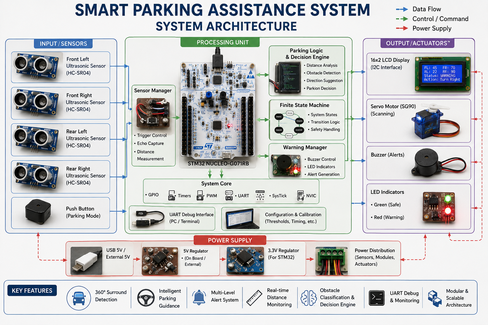
</p>

---

# Software Architecture

The firmware is divided into independent software layers.

<p align="center">
    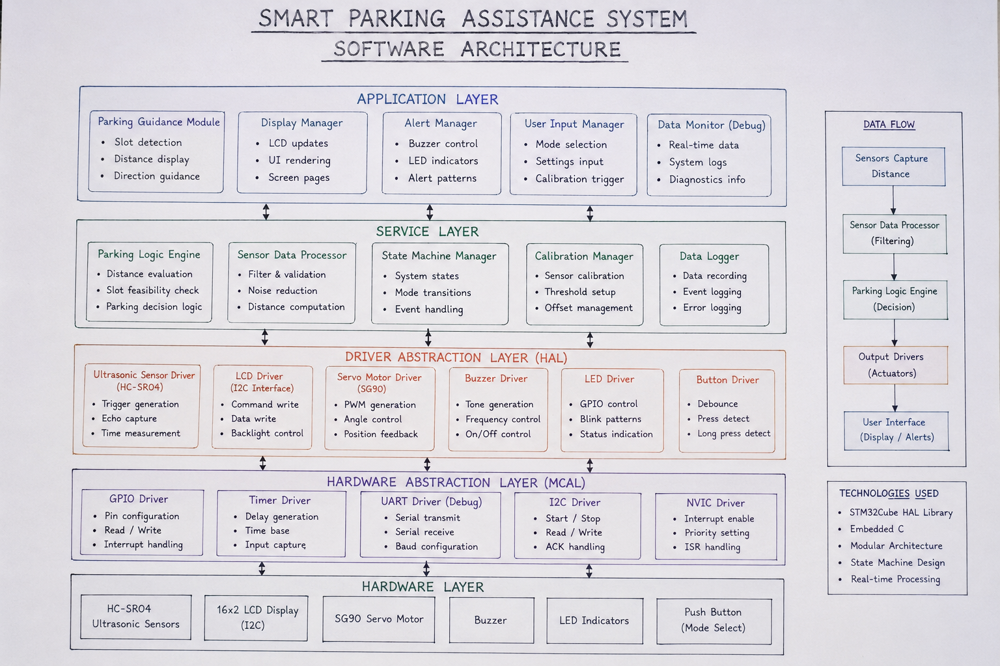
</p>

### Software Layers

### Application Layer

Responsible for:

- Parking Assistance Logic
- Obstacle Detection
- Driver Guidance
- Decision Making
- Warning Generation

---

### Service Layer

Provides reusable services including:

- Distance Processing
- LCD Updates
- Warning Manager
- Parking Decision Engine

---

### Driver Layer

Responsible for hardware control.

Drivers include:

- Ultrasonic Driver
- LCD Driver
- LED Driver
- Buzzer Driver
- Servo Driver
- UART Driver

---

### HAL Layer

Uses STM32 HAL APIs for:

- GPIO
- Timers
- UART
- I2C
- PWM
- Interrupt Handling

---

### Hardware Layer

Physical components connected to the STM32 board.

- Ultrasonic Sensors
- LCD
- LEDs
- Buzzer
- Servo Motor

---

# Firmware Architecture

The firmware follows a modular design where each peripheral and application module has its own source and header files.

<p align="center">
    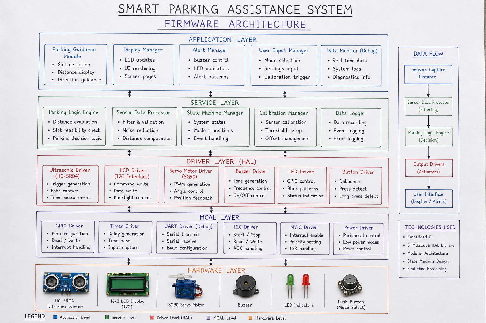
</p>

### Firmware Modules

| Module | Responsibility |
|---------|----------------|
| main | System initialization |
| parking | Parking logic |
| ultrasonic | Distance measurement |
| lcd_i2c | LCD communication |
| buzzer | Audible alerts |
| led | LED indication |
| servo | Servo control |
| uart_debug | Serial debugging |
| utilities | Helper functions |
| config | Global configuration |

---

# Data Flow

The firmware processes information in a continuous loop.

<p align="center">
    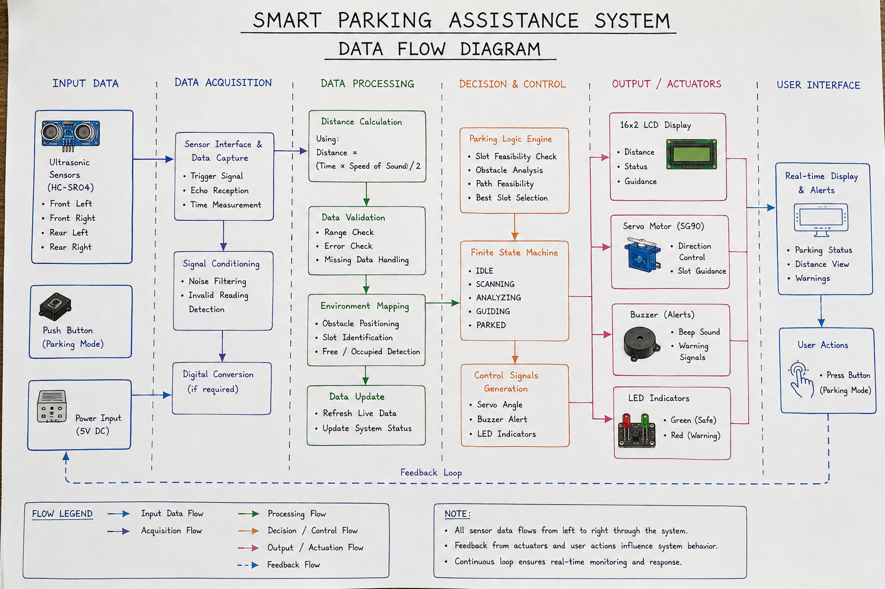
</p>

### Processing Sequence

```
HC-SR04 Sensors
        │
        ▼
Distance Measurement
        │
        ▼
Noise Filtering
        │
        ▼
Parking Decision Engine
        │
        ▼
Warning Generation
        │
        ├────────► LCD Display
        │
        ├────────► LEDs
        │
        ├────────► Buzzer
        │
        └────────► UART Debug Output
```

---

# Firmware Workflow

The firmware continuously performs the following operations:

1. Initialize peripherals
2. Trigger ultrasonic sensors
3. Measure echo pulse duration
4. Calculate distance
5. Filter measurements
6. Determine parking status
7. Update LCD
8. Update LEDs
9. Generate buzzer warning
10. Repeat continuously

---

# Design Goals

The firmware was designed with the following objectives:

- Modular architecture
- Easy maintenance
- Hardware abstraction
- Reusable drivers
- Efficient execution
- Scalable firmware
- Industry-standard project organization
- Automotive embedded software practices

---
# Flowcharts

The following flowcharts illustrate the execution flow of the Smart Parking Assistance System firmware.

---

# System Flowchart

<p align="center">
    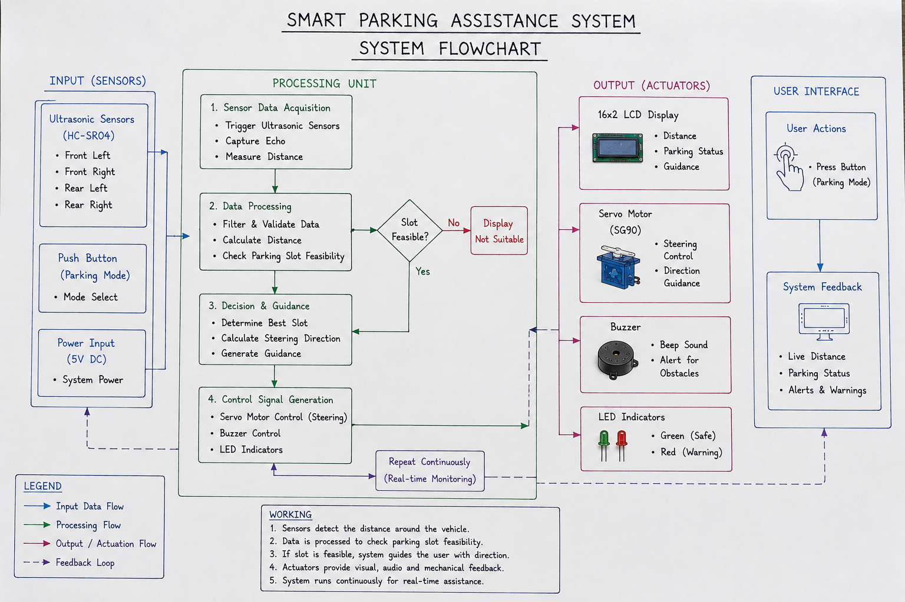
</p>

### Description

The system flowchart provides a high-level overview of the complete parking assistance workflow, starting from system initialization to continuous obstacle monitoring and driver guidance.

Main stages include:

- System Initialization
- Peripheral Configuration
- Sensor Measurement
- Distance Processing
- Parking Decision
- Driver Notification
- Continuous Monitoring

---

# Firmware Flowchart

<p align="center">
    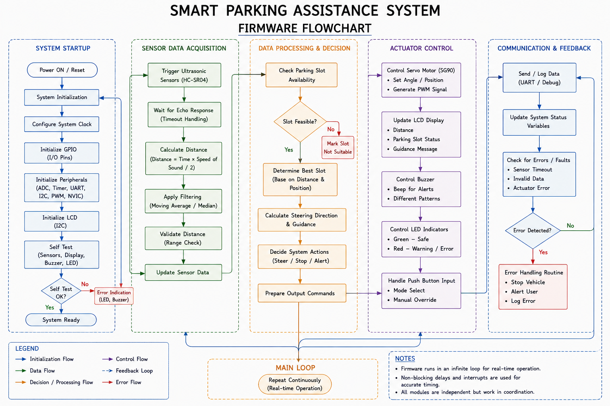
</p>

### Firmware Execution

The firmware repeatedly performs the following sequence:

1. Initialize peripherals
2. Trigger ultrasonic sensors
3. Read echo pulse duration
4. Calculate obstacle distance
5. Filter noisy measurements
6. Determine parking status
7. Update LCD
8. Control LEDs
9. Control buzzer
10. Repeat continuously

---

# Parking Decision Flowchart

<p align="center">
    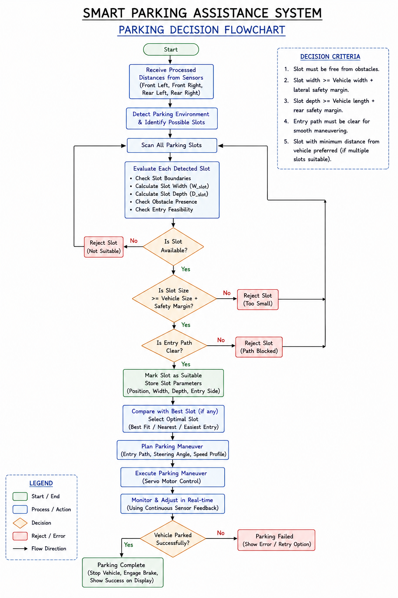
</p>

### Decision Logic

The parking algorithm compares measured distances against predefined safety thresholds.

| Distance | Parking Status | Driver Feedback |
|-----------|---------------|----------------|
| >100 cm | Safe | Green LED |
| 60–100 cm | Caution | Slow Buzzer |
| 30–60 cm | Warning | Medium Buzzer |
| 10–30 cm | Critical | Fast Buzzer |
| <10 cm | Emergency | Continuous Buzzer + Red LED |

---

# State Machine

<p align="center">
    
</p>

### Firmware States

The firmware is organized using a Finite State Machine (FSM).

- SYSTEM_INIT
- SENSOR_SCAN
- DISTANCE_CALCULATION
- DATA_FILTERING
- PARKING_DECISION
- LCD_UPDATE
- LED_UPDATE
- BUZZER_CONTROL
- UART_DEBUG
- ERROR_HANDLER

---

# Hardware Design

The Smart Parking Assistance System integrates multiple embedded peripherals to provide real-time parking guidance.

---

# Hardware Block Diagram

<p align="center">
    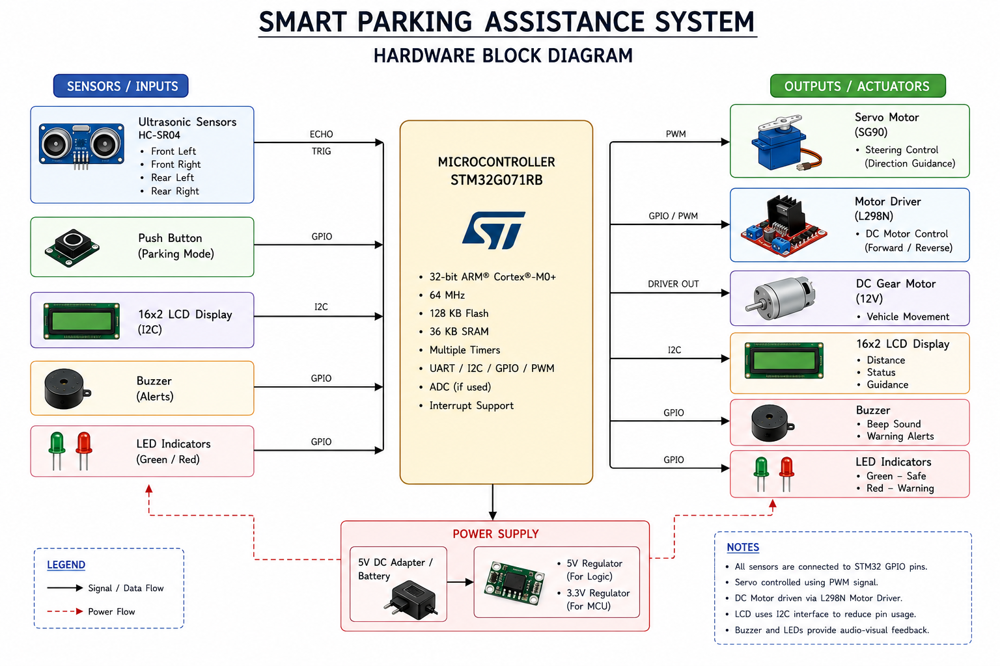
</p>

### Hardware Overview

The STM32 NUCLEO-G071RB serves as the central controller.

Connected peripherals include:

- Four HC-SR04 Ultrasonic Sensors
- 16×2 LCD (I2C)
- Active Buzzer
- Red LED
- Green LED
- Optional SG90 Servo Motor
- Push Button
- USB Power Supply

---

# Circuit Diagram

<p align="center">
    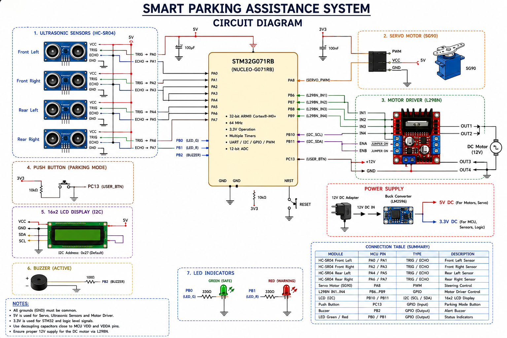
</p>

### Circuit Description

The STM32 interfaces with the ultrasonic sensors through GPIO pins, communicates with the LCD over I2C, drives the buzzer and LEDs through digital outputs, and optionally controls the servo motor using PWM.

The circuit is designed for easy prototyping using a NUCLEO development board.

---

# Sensor Layout

<p align="center">
    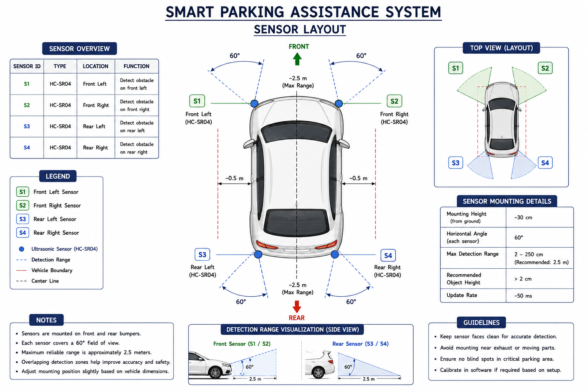
</p>

### Sensor Placement

Four ultrasonic sensors are positioned around the vehicle.

- Front Left (FL)
- Front Right (FR)
- Rear Left (RL)
- Rear Right (RR)

This arrangement enables continuous monitoring of obstacles from multiple directions during parking.

---

# Pin Connection Diagram

<p align="center">
    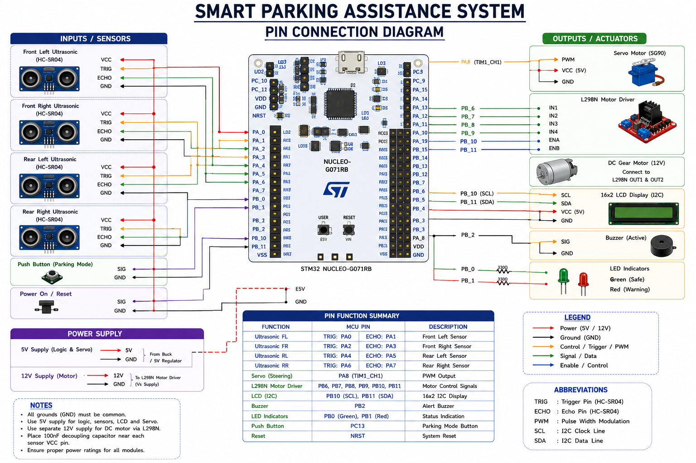
</p>

### Interface Summary

| Peripheral | STM32 Interface |
|------------|-----------------|
| HC-SR04 Sensors | GPIO + Timer |
| LCD (I2C) | I2C |
| Buzzer | GPIO |
| LEDs | GPIO |
| Servo Motor | PWM (Optional) |
| UART Debug | USART |

---

# Component Overview

<p align="center">
    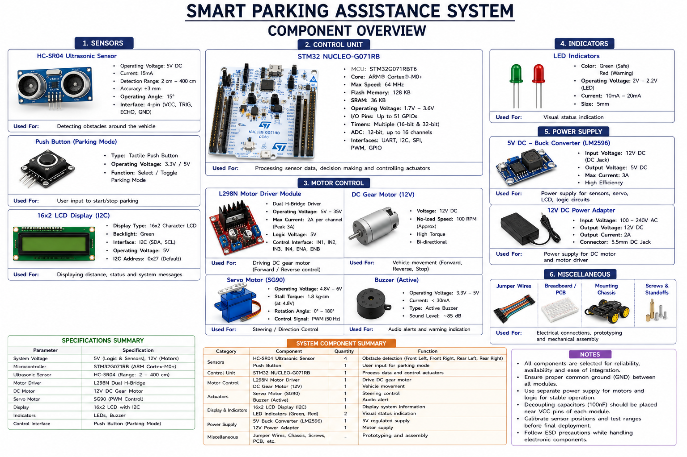
</p>

### Primary Hardware Components

- STM32 NUCLEO-G071RB
- HC-SR04 Ultrasonic Sensors
- 16×2 LCD with I2C Backpack
- SG90 Servo Motor
- Active Buzzer
- Red & Green LEDs
- Push Button
- USB Power Supply

The selected components provide a low-cost, modular platform suitable for learning embedded systems and automotive electronics concepts.

---
# Results

The following images are **concept illustrations** created to demonstrate the intended behavior of the Smart Parking Assistance System.

> **Note**
>
> These images are documentation assets and do **not** represent actual runtime screenshots, oscilloscope captures, serial monitor logs, or measured hardware outputs.

---

# Parking Assistance Dashboard

<p align="center">
    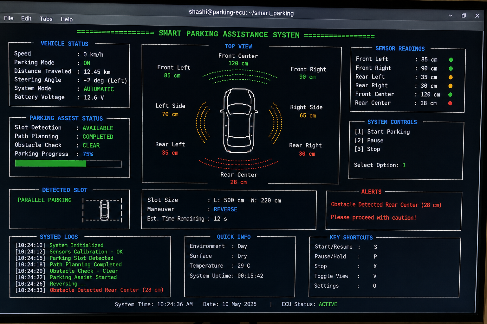
</p>

### Dashboard Overview

The concept dashboard illustrates:

- Parking mode
- Obstacle distances
- Driver guidance
- Warning level
- System status

---

# LCD Output

<p align="center">
    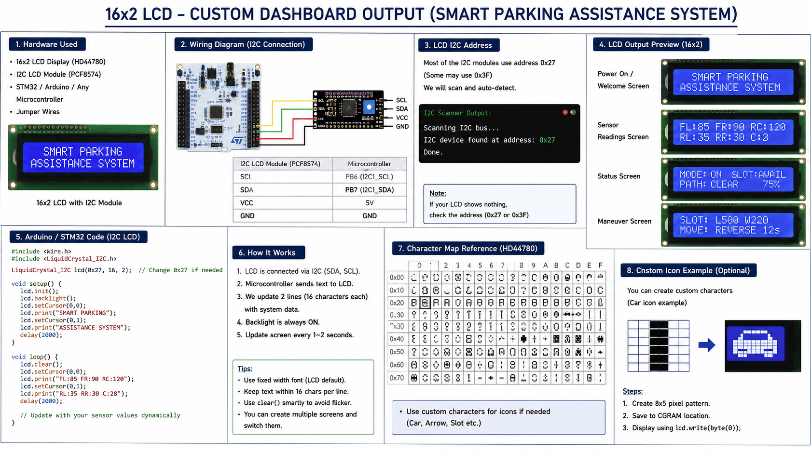
</p>

### LCD Information

The 16×2 LCD displays:

- Parking mode
- Measured obstacle distance
- Warning level
- Driver instruction

Example:

```
Distance : 45 cm
Status : WARNING
```

---

# Parking Assistance Concept

<p align="center">
    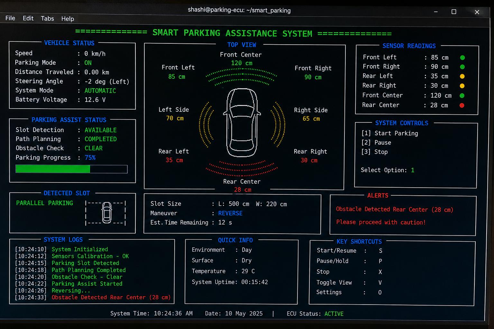
</p>

The concept visualization demonstrates how the system assists the driver during parking using ultrasonic sensing, visual indicators, and audible alerts.

---

# Obstacle Detection Concept

<p align="center">
    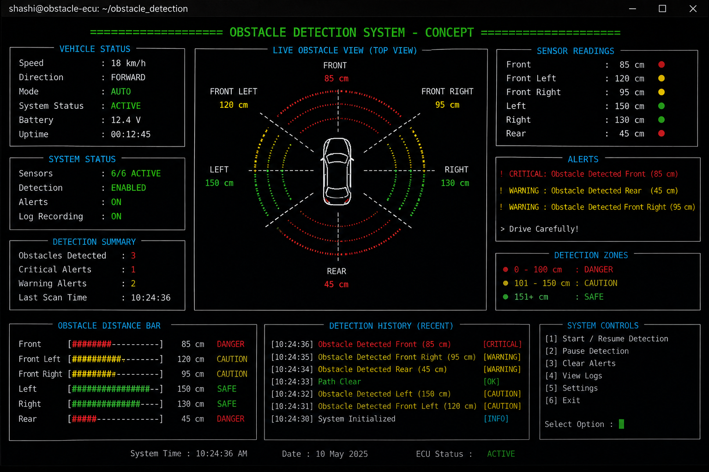
</p>

The obstacle detection concept illustrates the monitoring zones surrounding the vehicle and the corresponding driver notifications generated by the firmware.

---

# Repository Structure

```text
Smart-Parking-Assistance-System/
│
├── .github/
├── datasheets/
├── docs/
├── firmware/
├── hardware/
├── images/
│   ├── architecture/
│   ├── flowcharts/
│   ├── hardware/
│   └── results/
├── simulations/
│
├── README.md
├── LICENSE
├── .gitignore
├── CHANGELOG.md
├── CONTRIBUTING.md
├── CODE_OF_CONDUCT.md
└── CITATION.cff
```

---

# Installation

Clone the repository.

```bash
git clone https://github.com/<your-username>/Smart-Parking-Assistance-System.git
```

Move into the project directory.

```bash
cd Smart-Parking-Assistance-System
```

---

# Build Instructions

1. Open **STM32CubeIDE**.
2. Import the firmware project.
3. Verify the project configuration.
4. Build the firmware.
5. Flash the STM32 NUCLEO-G071RB board.
6. Connect the hardware peripherals.
7. Power the system.
8. Verify obstacle detection and parking guidance.

---

# Project Documentation

Detailed documentation is available in the following folders.

| Folder | Description |
|---------|-------------|
| docs/ | Complete project documentation |
| firmware/ | Firmware source code |
| hardware/ | Hardware resources |
| images/ | Repository graphics |
| datasheets/ | Component datasheets |
| simulations/ | Simulation resources |

---
# Testing Procedure

The Smart Parking Assistance System was tested by validating the firmware logic and peripheral functionality during development.

## Functional Tests

| Test | Expected Result |
|------|-----------------|
| STM32 Boot | System initializes successfully |
| Ultrasonic Sensors | Correct obstacle distance measured |
| LCD Display | Parking information updates correctly |
| LED Indicators | Correct status indication |
| Buzzer | Warning frequency changes with distance |
| Parking Decision Logic | Appropriate driver guidance generated |

---

## Test Scenarios

### Scenario 1 – Safe Zone

Obstacle Distance

> 100 cm

Expected Result

- Green LED ON
- Buzzer OFF
- LCD displays **SAFE**

---

### Scenario 2 – Caution Zone

Obstacle Distance

60–100 cm

Expected Result

- Slow buzzer
- LCD displays **CAUTION**

---

### Scenario 3 – Warning Zone

Obstacle Distance

30–60 cm

Expected Result

- Medium buzzer
- LCD displays **WARNING**

---

### Scenario 4 – Critical Zone

Obstacle Distance

10–30 cm

Expected Result

- Fast buzzer
- Red LED ON
- LCD displays **STOP**

---

### Scenario 5 – Emergency

Obstacle Distance

<10 cm

Expected Result

- Continuous buzzer
- Red LED ON
- Immediate stop indication

---

# Expected Results

The completed system is expected to:

- Measure obstacle distances accurately.
- Provide continuous parking assistance.
- Update the LCD in real time.
- Generate audible warnings based on obstacle proximity.
- Improve parking awareness for the driver.
- Demonstrate reliable embedded firmware execution.

---

# Advantages

- Modular firmware architecture
- Easy to understand
- Low hardware cost
- Scalable design
- Real-time obstacle detection
- Industry-style STM32 firmware
- Educational and portfolio-ready
- Suitable for automotive embedded learning

---

# Limitations

- Uses ultrasonic sensors only
- Limited sensing range
- Environmental conditions may affect measurements
- Driver assistance only
- Does not perform autonomous steering or braking

---

# Future Improvements

Potential enhancements include:

- CAN Bus communication
- Rear-view camera integration
- FreeRTOS task scheduling
- Sensor fusion
- Bluetooth or Wi-Fi connectivity
- Mobile application support
- Automatic parking algorithms
- Machine learning-based obstacle classification
- Embedded Linux gateway integration
- Voice-guided parking assistance

---

# Skills Demonstrated

This project demonstrates practical knowledge in:

## Embedded Systems

- Embedded C
- STM32 HAL
- STM32CubeIDE
- Firmware Development
- Real-Time Programming

---

## Peripheral Interfacing

- GPIO
- Timers
- PWM
- I2C
- UART
- External Interrupts

---

## Sensors & Devices

- HC-SR04 Ultrasonic Sensors
- 16×2 LCD (I2C)
- LEDs
- Active Buzzer
- Servo Motor

---

## Automotive Electronics

- Driver Assistance Systems
- Parking Assistance
- Embedded Control Systems
- Sensor Integration
- Automotive Firmware Design

---

## Software Engineering

- Modular Programming
- Layered Architecture
- State Machine Design
- Documentation
- Git
- GitHub

---
# Author

## Shashi Kiran

**Embedded Systems Engineer | Automotive Electronics Engineer**

Passionate about designing reliable embedded firmware and developing real-time automotive electronics applications using STM32 microcontrollers, Embedded C, and modern software engineering practices.

### Technical Interests

- Embedded Systems
- Automotive Electronics
- Embedded C
- STM32 Microcontrollers
- ARM Cortex-M
- Real-Time Systems
- IoT
- Firmware Development
- Automotive ECU Development
- Driver Assistance Systems (ADAS)

---

# Acknowledgements

This project was developed as part of my Embedded Systems and Automotive Electronics learning journey.

Special thanks to:

- STMicroelectronics
- STM32CubeIDE Development Team
- STM32 HAL Library
- Open Source Embedded Community
- Automotive Electronics Learning Resources

---

# Repository Highlights

- Industry-style folder structure
- Professional technical documentation
- Modular Embedded C firmware
- STM32 HAL implementation
- ATS-friendly project presentation
- GitHub portfolio ready
- Clean architecture diagrams
- Hardware documentation
- Firmware documentation
- Flowcharts and state machine documentation

---

# License

This project is licensed under the **MIT License**.

You are free to:

- Use
- Modify
- Distribute
- Learn from

this project under the terms of the MIT License.

For complete details, refer to the **LICENSE** file.

---

# Contributing

Contributions, suggestions, and improvements are welcome.

If you find a bug or have an enhancement idea:

1. Fork the repository.
2. Create a new feature branch.
3. Commit your changes.
4. Open a Pull Request.

Please read the **CONTRIBUTING.md** document before submitting contributions.

---

# Contact

If you have any questions or would like to discuss Embedded Systems or Automotive Electronics, feel free to connect through GitHub.

---

# Repository Status

**Project Status:** Completed

This repository is maintained for learning, portfolio demonstration, and continuous improvement.

Future updates may include additional features, firmware enhancements, and hardware improvements.

---

<div align="center">

## ⭐ If you found this project helpful, consider giving it a Star.

### Thanks for visiting this repository!

**Happy Coding!**

</div>
